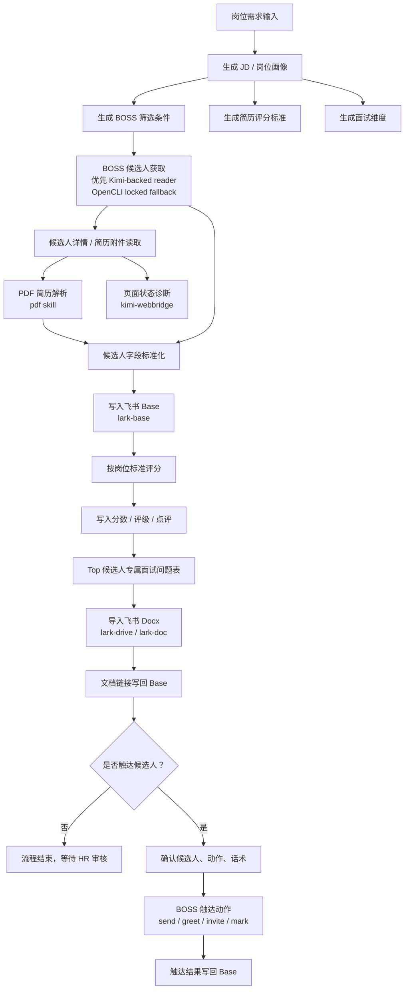
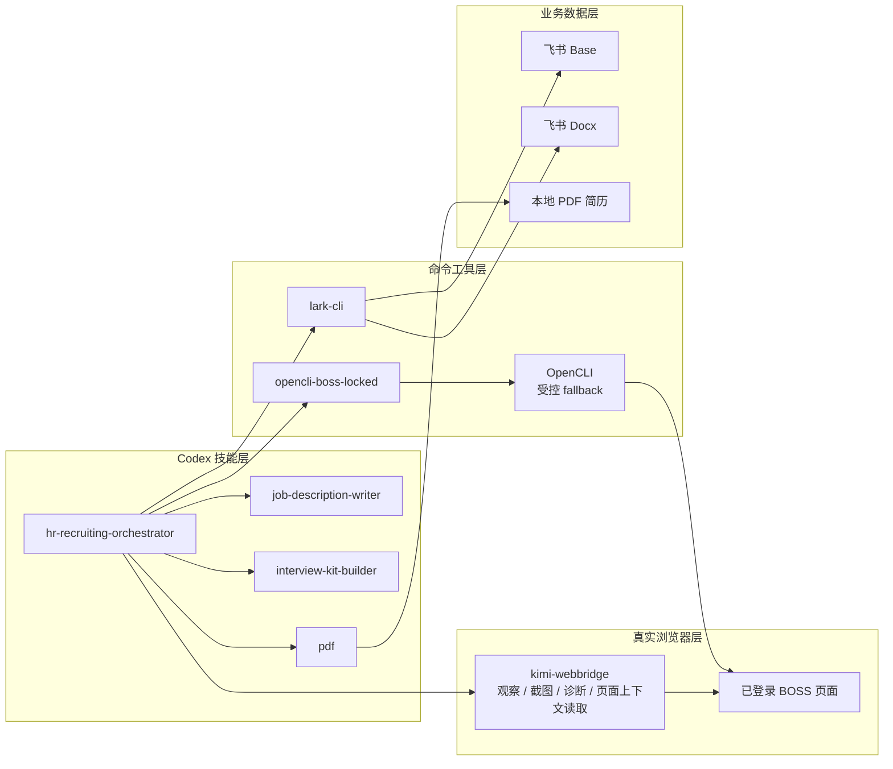
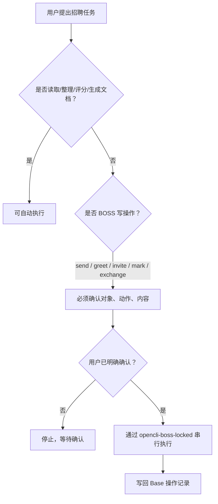

# Wohu Talent OS · HR 招聘工作台

本仓库是 Wohu Talent OS 的 HR 招聘工作台，将“岗位准备 → BOSS 候选人获取 → 飞书 Base 入库 → 简历评分 → Top 候选人点评 → 专属面试问题表 → 候选人触达”沉淀成可复用、可审计的流程。

核心入口是 Codex skill：`hr-recruiting-orchestrator`。

默认模式是“半自动审核”：

- 可以自动读数据、整理字段、生成评分标准、评分、写点评、生成面试问题表。
- BOSS 真实触达动作必须单独确认，包括 `send`、`greet`、`batchgreet`、`invite`、`mark`、`exchange`。
- 飞书 Base 是业务主库，本地文件只做临时证据、排障和交付文档。

> [!IMPORTANT]
> 仓库只保存流程、技能、脚本和文档。候选人简历、原始 JSON、截图、Cookie、登录态、Base token、密钥和其他凭据禁止提交。所有 BOSS 写操作必须由 HR 明确确认对象、动作和内容。

---

## 1. 这套包解决什么问题

招聘流程里最容易踩坑的点有四类：

1. BOSS 页面被调试工具长期附着后不断刷新。
2. BOSS 数据、简历附件、飞书 Base 字段、面试文档分散，流程不可复用。
3. 简历评分标准每次临时写，候选人点评口径不一致。
4. BOSS 打招呼、发消息、邀约属于真实外部动作，不能让自动化误触达候选人。

本包把这些规则固化成技能和文档：

- BOSS 页面控制优先用 `kimi-webbridge`；当前实测 Kimi 页面上下文 XHR 不会触发 BOSS 硬重载。
- OpenCLI 只保留为受控 fallback：必须走 `opencli-boss-locked`，串行执行，执行后解绑。
- BOSS 电子简历和附件简历分开入库：电子简历来自 Kimi BOSS adapter 的 `resume` 输出，写入 `电子简历*` 字段；附件简历下载到本地后交给 `pdf` skill 解析，写入 `附件简历*` 字段。
- 飞书 Base 作为唯一业务落点，数据库表里优先保留来源明确的细分字段，再按需生成汇总字段。
- JD、评分标准、面试问题表都按岗位需求参数化生成。
- 所有 BOSS 写操作先停下确认，再执行。

---

## 2. 仓库目录

```text
Wohu-Talent-OS/
├─ install.ps1
├─ verify.ps1
├─ manifest.json
├─ README.md
├─ docs/
│  ├─ WORKFLOW.md
│  ├─ SECURITY.md
│  ├─ TROUBLESHOOTING.md
│  └─ HANDOFF.md
└─ skills/
   ├─ codex/
   │  ├─ hr-recruiting-orchestrator/
   │  ├─ opencli-boss-locked/
   │  ├─ pdf/
   │  ├─ kimi-webbridge/
   │  ├─ job-description-writer/
   │  └─ interview-kit-builder/
   └─ agents/
      ├─ lark-shared/
      ├─ lark-base/
      ├─ lark-doc/
      └─ lark-drive/
```

各目录职责：

- `skills/codex/hr-recruiting-orchestrator`：招聘总控。负责阶段路由、数据落点、安全边界和流程编排。
- `skills/codex/opencli-boss-locked`：BOSS OpenCLI 锁定封装。只作为 OpenCLI fallback，避免新开 BOSS 标签页或长期附着页面。
- `skills/codex/pdf`：PDF 简历读取、页面渲染检查、文本提取和摘要。
- `skills/codex/kimi-webbridge`：真实浏览器页面观察、截图、可见文本读取、页面状态诊断和稳定的 BOSS 页面上下文读取。
- `skills/codex/job-description-writer`：岗位说明和招聘需求生成。
- `skills/codex/interview-kit-builder`：面试问题表、评分卡、面试评估框架生成。
- `skills/agents/lark-*`：飞书 Base、文档、云空间相关操作能力。
- `docs/`：交接、排障、安全和流程文档。
- `install.ps1`：把技能复制到当前 Windows 用户目录。
- `verify.ps1`：安装后做基础检查。

---

## 3. 整体流程设计图

### 3.1 总流程



### 3.2 工具分工



### 3.3 安全闸门



---

## 4. 需要准备的外部工具

本包只分发技能和流程，不分发账号、登录态、Cookie、候选人数据和全局 CLI 二进制。

使用者需要自己准备：

| 工具 | 用途 | 检查命令 |
|---|---|---|
| Node.js / npm | 安装和运行 OpenCLI 等工具 | `node --version` / `npm --version` |
| OpenCLI | BOSS fallback 读取和动作执行 | `opencli --version` |
| lark-cli | 飞书 Base、文档、云空间读写 | `lark-cli --version` |
| Kimi WebBridge | 真实浏览器页面观察、诊断和稳定页面上下文读取 | `kimi-webbridge status` |
| Chrome / Edge | 登录 BOSS、飞书等页面 | 手动确认已登录 |
| Codex Desktop | 使用本包内技能 | 打开 Codex 后查看 skills |
| Python PDF 依赖 | 解析 PDF 附件简历 | `python -c "import pdfplumber,pypdf,reportlab"` |

OpenCLI 安装示例：

```powershell
npm install -g @jackwener/opencli
opencli --version
```

Kimi WebBridge 安装示例：

```powershell
irm https://kimi-web-img.moonshot.cn/webbridge/install.ps1 | iex
kimi-webbridge status
```

PDF 附件简历解析需要本机 Python 依赖。首次使用前执行：

```powershell
python -m pip install pdfplumber pypdf reportlab
```

飞书工具安装和登录按团队现有方式执行。安装后至少确认：

```powershell
lark-cli --version
```

---

## 5. 安装步骤

### 5.1 解压

把压缩包解压到任意本地目录，例如：

```text
D:\tools\hr-recruiting-workflow-kit\
```

### 5.2 安装技能

在 PowerShell 里进入解压目录：

```powershell
cd "D:\tools\hr-recruiting-workflow-kit"
powershell -ExecutionPolicy Bypass -File ".\install.ps1"
```

安装脚本会复制：

- `skills/codex/*` → `%USERPROFILE%\.codex\skills`
- `skills/agents/*` → `%USERPROFILE%\.agents\skills`

如果目标目录已有同名技能，默认会先备份为：

```text
skill-name.backup-YYYYMMDD-HHMMSS
```

### 5.3 验证安装

继续执行：

```powershell
powershell -ExecutionPolicy Bypass -File ".\verify.ps1"
```

期望看到：

```text
[PASS] hr-recruiting-orchestrator installed
[PASS] opencli-boss-locked installed
[PASS] pdf skill installed
[PASS] kimi-webbridge skill installed
[PASS] lark-base installed
[PASS] opencli command available
[PASS] lark-cli command available
[PASS] BOSS adapter navigation patch check
[PASS] hr-recruiting-orchestrator self-test
Verify complete.
```

如果 `kimi-webbridge` 不在 `PATH`，但默认安装路径存在，也算可用。

---

## 6. 第一次使用前检查

### 6.1 BOSS 页面准备

1. 打开浏览器。
2. 登录 BOSS 招聘端。
3. 只保留一个 BOSS 页面，避免 OpenCLI 绑错标签页。
4. 不要让多个自动化工具同时控制 BOSS。

如果页面之前被调试工具影响过，先执行：

```powershell
opencli browser site:boss unbind
```

### 6.2 飞书准备

准备一个飞书 Base 作为候选人业务主库。建议至少包含这些字段：

| 字段 | 用途 |
|---|---|
| 姓名 | 候选人展示名 |
| 当前职位 / 最近公司 | 初筛信息 |
| 工作年限 | 经验判断 |
| 城市 | 区域判断 |
| 学历 | 基础要求判断 |
| BOSS 原始信息 | 原始 JSON 或摘要 |
| 电子简历姓名 / 学历 / 工作年限 / 期望职位 / 当前或最近公司 | BOSS 在线电子简历拆分字段 |
| 电子简历工作经历 / 教育经历 / 项目经历 / 技能 / 原始JSON | BOSS 在线电子简历的结构化细分内容 |
| 附件简历文件 / 文件名 / 链接 / 文本 / 摘要 / 解析状态 | PDF/Word 等附件简历，下载后由 `pdf` skill 解析 |
| 简历来源说明 | 标记当前记录使用电子简历、附件简历，或两者合并评估 |
| 岗位匹配评分 | 0-100 分 |
| 岗位匹配点评 | 优势、风险、面试关注点 |
| 推荐等级 | 强推荐 / 可约面 / 备选 / 暂缓 |
| 电子简历部门 | BOSS 电子简历 JSON 中真实提供的部门；未提供时写“未提供” |
| 数据状态说明 | 同步、评分、字段缺口等可审计说明 |
| 专属面试问题表链接 | 飞书 Docx 链接 |
| 触达状态 | 未触达 / 已打招呼 / 已邀约等 |
| 最近触达时间 | 操作时间 |
| 触达备注 | 失败原因或补充说明 |

实际字段名以你的 Base 字段为准。写入前必须先读取字段列表，不要猜字段名。

如果是已有招聘 Base，可以先用随包脚本补齐推荐字段：

```powershell
powershell -ExecutionPolicy Bypass -File "$HOME\.codex\skills\hr-recruiting-orchestrator\scripts\ensure-recruiting-base-schema.ps1" -BaseToken "<base_token>" -TableId "<table_id>"
```

### 6.3 电子简历和附件简历准备

简历来源分两类，不要混写：

1. 电子简历：BOSS 右侧在线简历面板，由 `kimi-boss.ps1 resume <uid>` 读取，写入 `电子简历姓名`、`电子简历工作经历`、`电子简历教育经历`、`电子简历原始JSON` 等字段。
2. 附件简历：候选人上传的 PDF/Word 文件，先通过 BOSS 或飞书下载到本地；PDF 用 Codex `pdf` skill 读取，结果写入 `附件简历文本`、`附件简历摘要`、`附件简历解析状态` 等字段。

不要用 BOSS 页面可见文本替代 PDF 附件解析，也不要把 PDF 解析文本写进 `电子简历*` 字段。

---

## 7. 推荐使用方式

在 Codex 里直接描述目标，让 `hr-recruiting-orchestrator` 总控调度。

### 7.1 从岗位开始

```text
使用 hr-recruiting-orchestrator，帮我为“后端开发工程师（AI内容生成平台方向）”设计招聘流程：
1. 生成岗位画像和 BOSS 筛选条件；
2. 生成简历评分标准；
3. 生成面试维度；
4. 输出可以同步到飞书 Base 的字段建议。
```

产出应包含：

- 岗位职责和任职要求整理。
- BOSS 筛选关键词、城市、经验、学历、技能条件。
- 评分维度和权重。
- 面试问题维度。
- Base 字段建议。

### 7.2 从 BOSS 候选人同步到飞书 Base

```text
使用 hr-recruiting-orchestrator，把当前 BOSS 页面候选人同步到这个飞书 Base：
Base URL: <你的飞书多维表格链接>
要求：
1. 先读取 Base 字段；
2. 只跑 BOSS 只读命令；
3. 候选人信息标准化后写入 Base；
4. 保存同步摘要。
```

执行原则：

- 优先用 Kimi-backed 页面上下文读取；必须用 OpenCLI 时走 `opencli-boss-locked`。
- 命令串行执行。
- OpenCLI fallback 执行后必须解绑。
- 不执行任何 BOSS 写操作。

### 7.3 按岗位要求给简历评分

```text
使用 hr-recruiting-orchestrator，按下面岗位要求给 Base 里的候选人评分：
<粘贴岗位 JD>

要求：
1. 先生成评分标准；
2. 对候选人写入岗位匹配评分；
3. Top 10 写入岗位匹配点评；
4. 点评要包含优势、风险、面试关注点。
```

也可以直接使用随包参数化脚本，从岗位信息表读取 `需求背景描述`、`岗位名称`、`岗位需求描述`、`简历筛选条件` 后批量重评：

```powershell
powershell -ExecutionPolicy Bypass -File "$HOME\.codex\skills\hr-recruiting-orchestrator\scripts\rerank-candidates-by-job-table.ps1" `
  --base-token "<base_token>" `
  --candidate-table-id "<candidate_table_id>" `
  --job-table-id "<job_table_id>"
```

这个脚本会写回：

- `岗位匹配评分`
- `岗位匹配点评`
- `推荐等级`
- `电子简历部门`
- `数据状态说明`

注意：岗位描述只作为评分规则来源，不会混入候选人证据文本里做关键词命中，避免“所有人都被岗位关键词虚高匹配”。

评分建议口径：

| 分数段 | 判断 |
|---|---|
| 85-100 | 强匹配，优先约面 |
| 75-84 | 较匹配，建议进一步确认关键短板 |
| 60-74 | 有部分匹配点，作为备选 |
| 0-59 | 当前岗位不优先推进 |

### 7.4 给 Top 候选人生成专属面试问题表

```text
使用 hr-recruiting-orchestrator，给 Base 中评分最高的 10 位候选人生成专属面试问题表：
1. 每个人结合岗位要求和简历经历；
2. 问题分为技术深挖、项目复盘、工程能力、AI/AIGC 理解、风险验证；
3. 生成飞书在线文档；
4. 文档链接写回 Base 的“专属面试问题表链接”字段。
```

附件字段如果写入失败，优先用飞书 Docx 链接兜底。

### 7.5 触达候选人

BOSS 触达必须明确确认。推荐这样发起：

```text
使用 hr-recruiting-orchestrator，准备给候选人张三发送 BOSS 打招呼消息。
先帮我生成话术，不要发送。
```

确认后再说：

```text
确认发送给张三，动作是 greet，话术使用上一条生成的版本。
```

没有这类确认时，技能应停止等待，不得自动触达。

---

## 8. 端到端操作示例

### 场景：后端开发工程师岗位

第一步：准备岗位和评分标准。

```text
使用 hr-recruiting-orchestrator：
岗位名称：后端开发工程师（AI内容生成平台方向）
职责：AI内容生成平台后端架构、API封装、素材处理、投放数据闭环。
要求：Java、Spring Boot、MySQL、Docker、腾讯云、AIGC API 对接。
请生成 BOSS 筛选条件、评分标准和面试维度。
```

第二步：同步候选人。

```text
当前浏览器已登录 BOSS 招聘端，只保留了一个 BOSS 标签页。
请使用 hr-recruiting-orchestrator 同步当前候选人到飞书 Base：
<Base URL>
只做读取和入库，不做任何触达。
```

第三步：评分。

```text
按刚才的岗位评分标准，对 Base 里的候选人打分，并写入“岗位匹配评分”。
Top 10 额外写入“岗位匹配点评”。
```

第四步：生成面试问题表。

```text
给 Top 10 候选人生成专属面试问题表。
优先生成飞书 Docx，并把链接写回“专属面试问题表链接”。
```

第五步：人工审核后触达。

```text
帮我为 Top 3 候选人分别生成 BOSS 打招呼话术。
先只生成，不要发送。
```

确认发送时再逐个确认对象、动作和话术。

---

## 9. OpenCLI 和 Kimi WebBridge 怎么选

| 场景 | 推荐工具 | 原因 |
|---|---|---|
| 读取 BOSS 候选人列表、详情、聊天列表 | `kimi-webbridge` / Kimi-backed reader | 当前实测不触发 BOSS 硬重载 |
| 批量同步候选人到 Base | Kimi-backed reader；OpenCLI locked 只作 fallback | 页面稳定优先，OpenCLI 有明确 reload 风险 |
| 看页面是否刷新、弹窗、是否登录 | `kimi-webbridge` | 使用真实浏览器视角 |
| 截图、看页面可见文字 | `kimi-webbridge` | 适合诊断 |
| 发消息、打招呼、邀约 | `opencli-boss-locked` + 人工确认 | 外部副作用必须留安全闸门 |
| 解析 PDF 简历 | `pdf` skill | PDF 页面和文本解析更专业 |

注意：这里的结论来自本机实测隔离。Kimi 直接在 BOSS 页面上下文里请求同一接口不重载；OpenCLI `browser eval` 即使只执行 `document.title` 也会让 BOSS 文档硬重载。因此后续稳定采集应优先迁移到 Kimi-backed reader；OpenCLI locked wrapper 保留为有安全闸门的 fallback。

本包已经内置 Kimi-backed 招聘端 adapter：

```powershell
powershell -ExecutionPolicy Bypass -File "$HOME\.codex\skills\hr-recruiting-orchestrator\scripts\kimi-boss.ps1" chatlist --limit 20 -f json
```

调试和验收时用 `-f object`，里面会带 `stable=true/false`：

```powershell
powershell -ExecutionPolicy Bypass -File "$HOME\.codex\skills\hr-recruiting-orchestrator\scripts\kimi-boss.ps1" chatlist --limit 1 -f object
```

本轮完整 Kimi 流程测试结果：

| 指标 | 结果 |
|---|---:|
| BOSS chat 候选人列表读取 | 55 人 |
| friend-list 页面内请求耗时 | 约 122 ms |
| friend-list 端到端往返耗时 | 约 130 ms |
| 可见简历面板抓取 | 10 / 10 成功 |
| 平均简历面板抓取耗时 | 约 1907 ms / 人 |
| 平均聊天历史请求耗时 | 约 45 ms |
| 写入飞书 Base | 10 条 |
| 生成专属面试问题表 | 3 份 |
| 端到端流程耗时 | 约 29.2 秒 |
| 页面硬重载检查 | 未发生，`performance.timeOrigin` 未变化 |

测试 Base：

```text
https://wohukeji.feishu.cn/base/TXuzbMxUHas61wsO891cPkOynnf
```

本轮评估结论：Kimi 在当前 BOSS 页面上的效率和稳定性都足够作为主读取底座；OpenCLI 的优势是已有 adapter 结构化输出，但 BOSS reload 风险已被实测证实，所以只能做 fallback。

---

## 10. BOSS 稳定性规则

BOSS 页面刷新问题已在本环境中确认并定位：裸跑 `opencli boss chatlist --limit 1 -f json --site-session persistent --keep-tab true` 这类 raw persistent keep-tab 命令，会让当前 BOSS 页面发生真实硬重载。

已排除的原因：

- 不是 BOSS friend-list 业务接口本身；Kimi WebBridge 直接请求同一接口时页面不重载。
- 不是候选人数据内容。
- 不是 adapter `page.goto(...)`；即使 OpenCLI 执行空操作 `opencli browser site:boss eval "document.title"` 也会重载。

定位到的原因：OpenCLI Browser Bridge 的 `exec` / `page.evaluate` 页面执行路径会触发 BOSS 文档 unload / reload。执行规则：

1. BOSS 页面读取优先走 Kimi-backed reader。
2. 必须用 OpenCLI 时，走 `opencli-boss-locked`。
3. 不裸跑 `opencli boss ... --site-session persistent --keep-tab true`。
4. 每次只跑一个 BOSS 命令，不并发。
5. OpenCLI fallback 执行后解绑。
6. 不让 OpenCLI 自动新开 BOSS 标签页。
7. 发现页面刷新，先执行：

```powershell
opencli browser site:boss unbind
```

8. 如果 OpenCLI 升级后 BOSS 命令异常，先检查补丁：

```powershell
powershell -ExecutionPolicy Bypass -File "$HOME\.codex\skills\opencli-boss-locked\scripts\patch-boss-adapter-navigation.ps1" -Check
```

检查失败时重新应用：

```powershell
powershell -ExecutionPolicy Bypass -File "$HOME\.codex\skills\opencli-boss-locked\scripts\patch-boss-adapter-navigation.ps1"
```

Kimi BOSS adapter 覆盖的招聘端命令：

| 类型 | 命令 | 说明 |
|---|---|---|
| 只读 | `status` | 查看当前 BOSS 页和稳定性 |
| 只读 | `chatlist` | 招聘端聊天列表 |
| 只读 | `chatmsg` | 指定候选人聊天记录 |
| 只读 | `resume` | 指定候选人右侧电子简历面板，输出 `电子简历*` 字段 |
| 只读 | `recommend` | 新招呼/推荐候选人 |
| 只读 | `joblist` | 已发布职位 |
| 只读 | `stats` | 职位沟通统计 |
| 只读 | `label-list` | 候选人标签列表 |
| 写操作默认 dry-run | `send` | 发消息，需 `--confirm` 执行 |
| 写操作默认 dry-run | `greet` | 打招呼，需 `--confirm` 执行 |
| 写操作默认 dry-run | `batchgreet` | 批量打招呼，需 `--confirm` 执行 |
| 写操作默认 dry-run | `invite` | 面试邀请，需 `--confirm` 执行 |
| 写操作默认 dry-run | `mark` | 标记候选人，需 `--confirm` 执行 |
| 写操作默认 dry-run | `exchange` | 交换联系方式，需 `--confirm` 执行 |

全量验收命令：

```powershell
powershell -ExecutionPolicy Bypass -File "$HOME\.codex\skills\hr-recruiting-orchestrator\scripts\test-kimi-boss-adapter.ps1" -RequireCandidate
```

这个验收会跑完所有招聘端读命令和写命令 dry-run，并检查每一步 `stable=true`。

---

## 11. 飞书 Base 写入规则

### 11.1 写入前

必须先读取字段列表。字段名以飞书返回为准。

不要假设一定存在这些字段：

- `岗位匹配评分`
- `岗位匹配点评`
- `专属面试问题表链接`
- `触达状态`

如果字段不存在，先让用户确认是否新增字段，或写入已有等价字段。

### 11.2 简历来源字段规则

电子简历和附件简历必须分开写入：

- `kimi-boss.ps1 resume <uid>` 只代表 BOSS 电子简历，写入 `电子简历*` 字段。
- PDF/Word 附件简历下载后才交给 `pdf` skill，解析结果写入 `附件简历*` 字段。
- 评分和面试问题可以综合两个来源，但评分依据必须注明来自电子简历、附件简历，还是两者共同支持。
- `简历来源说明` 用来记录当前可用来源，例如“电子简历”、“附件简历”或“两者已合并评估”。

### 11.3 附件和文档

飞书附件字段可能出现 `MOBILE_ONLY` 或 API 不支持写入的情况。

面试问题表推荐路径：

```text
本地 Markdown / Docx → 飞书 Docx → URL 写回 Base
```

不要强依赖附件字段。

### 11.3 原始数据

候选人原始 JSON 可以保存为证据，但不要把本地证据文件发给无权限同事。

分发本包时不包含任何候选人原始数据。

---

## 12. 简历评分标准设计

评分标准必须由岗位需求生成，不写死某一个岗位。

建议结构：

| 维度 | 权重 | 判断点 |
|---|---:|---|
| 核心技术匹配 | 30 | 语言、框架、数据库、工程基础 |
| 项目经验匹配 | 25 | 是否做过同类业务、复杂度、独立性 |
| 岗位关键场景 | 20 | AI/AIGC、开放平台、数据链路、部署等 |
| 稳定性和交付能力 | 15 | 性能优化、线上问题、团队协作 |
| 加分项 | 10 | 云服务、Vibe Coding、NAS/素材库等 |

输出字段建议：

- `岗位匹配评分`：数字，0-100。
- `岗位匹配等级`：强匹配 / 较匹配 / 备选 / 不优先。
- `岗位匹配点评`：优势、风险、面试关注点。
- `评分依据`：引用简历中的关键事实，避免空泛判断。

---

## 13. 面试问题表标准

每个候选人的专属问题表建议包含：

1. 候选人概览。
2. 岗位匹配结论。
3. 简历亮点。
4. 风险点。
5. 技术深挖问题。
6. 项目复盘问题。
7. 工程能力问题。
8. AI/AIGC 或业务相关问题。
9. 反向提问建议。
10. 面试官评分卡。

问题要围绕候选人真实经历，不要生成泛泛而谈的问题。

---

## 14. 常见问题

### Q1：页面又开始刷新怎么办？

先停掉自动化，再执行：

```powershell
opencli browser site:boss unbind
```

然后确认浏览器只保留一个 BOSS 页面。优先改用 Kimi-backed reader；必须用 OpenCLI 时再跑 `opencli-boss-locked`。不要重复裸跑 `opencli boss ... --keep-tab true`。

### Q2：OpenCLI 更新后命令报错怎么办？

先检查 BOSS adapter 补丁：

```powershell
powershell -ExecutionPolicy Bypass -File "$HOME\.codex\skills\opencli-boss-locked\scripts\patch-boss-adapter-navigation.ps1" -Check
```

失败就重新应用补丁。不要继续批量跑 BOSS 命令。

### Q3：电子简历和附件简历怎么区分？

电子简历是 BOSS 页面里的在线简历面板，由 `kimi-boss.ps1 resume <uid>` 读取并写入 `电子简历*` 字段。附件简历是候选人上传的 PDF/Word 文件，下载后由 `pdf` skill 解析并写入 `附件简历*` 字段。两者可以共同用于评分，但数据库字段不能混写。

### Q4：飞书附件写不进去怎么办？

改用飞书 Docx 链接字段。把面试问题表导入为在线文档，把 URL 写回 Base。

### Q5：能不能全自动给候选人发消息？

不能默认全自动。BOSS 写操作必须逐次确认对象、动作和内容。

### Q6：包里为什么没有候选人数据？

候选人数据属于敏感业务数据。本包只分发流程和技能，不分发简历、原始 JSON、截图、Cookie 或账号登录态。

---

## 15. 交接给同事的建议话术

可以直接把下面这段发给同事：

```text
这是 HR 招聘工作流包。先解压，然后在 PowerShell 执行：

powershell -ExecutionPolicy Bypass -File ".\install.ps1"
powershell -ExecutionPolicy Bypass -File ".\verify.ps1"

使用前自己登录 BOSS 和飞书。BOSS 页面控制和稳定读取优先用 Kimi WebBridge；OpenCLI 只作为 opencli-boss-locked fallback；PDF 简历用 pdf skill，候选人数据写入飞书 Base。任何 BOSS 发消息、打招呼、邀约、标记动作都需要你明确确认后才会执行。
```

---

## 16. 版本和升级建议

当前包已包含 2026-05-18 的流程更新：

- BOSS 读取主路径为 Kimi-backed adapter，OpenCLI 只做受控 fallback。
- 电子简历和附件简历字段分离。
- 电子简历项目经历通过在线简历详情补齐，不再依赖聊天侧紧凑面板。
- 新增岗位信息表驱动的批量重评脚本 `rerank-candidates-by-job-table.ps1`。
- 分享包不包含候选人原始 JSON、同步结果、评分结果、截图、Cookie 或登录态。

建议定期检查：

```powershell
opencli --version
lark-cli --version
kimi-webbridge status
```

OpenCLI 升级后要重新检查 BOSS patch：

```powershell
powershell -ExecutionPolicy Bypass -File "$HOME\.codex\skills\opencli-boss-locked\scripts\patch-boss-adapter-navigation.ps1" -Check
```

如果团队后续要沉淀一键岗位包，可以把特定岗位的 JD、评分标准、Base 字段模板和面试问题表模板放到单独目录，不要直接改本总控 skill 的通用规则。

---

## 17. 最小可行跑通路径

新同事第一次使用建议只跑最小闭环：

1. 安装本包。
2. 执行 `verify.ps1`。
3. 登录 BOSS 和飞书。
4. 准备一个测试 Base。
5. 只同步 1-3 个候选人。
6. 给这 1-3 个候选人评分。
7. 给 1 个候选人生成面试问题表。
8. 确认文档链接能写回 Base。
9. 不做 BOSS 触达，等 HR 审核流程确认后再启用。

这个闭环跑通后，再扩大到完整岗位批量筛选。
